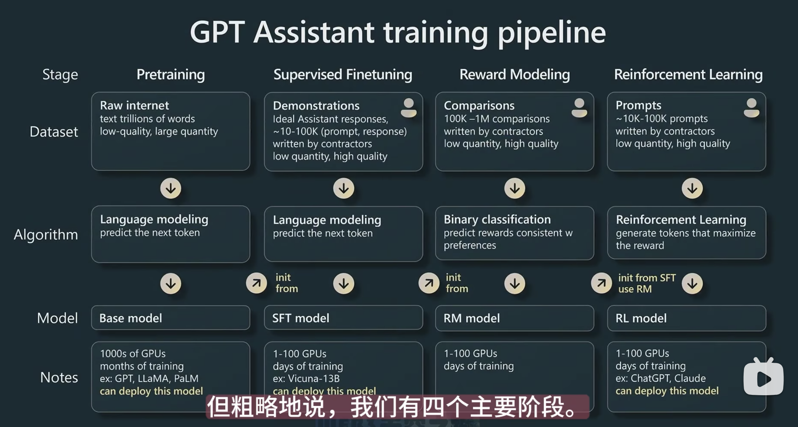

# How to train (Chat)GPT 

## Pretraining预训练
99%的计算时间都在这一步

### Data collection
LLaMA model展示了如何mix数据，来形成GPT数据集
### Tokenization
Raw text -> tokens -> integers 

GPT-3 VS. LLaMA:
- 175B parameters VS. 65B parameters
LLaMA是一个更强大的模型，是因为该模型的训练时间更长 

## Supervised fine-tuning有监督微调

## Reward Modeling奖励建模

## Reinforcement Learning 强化学习微调

# How to use to boost your task
