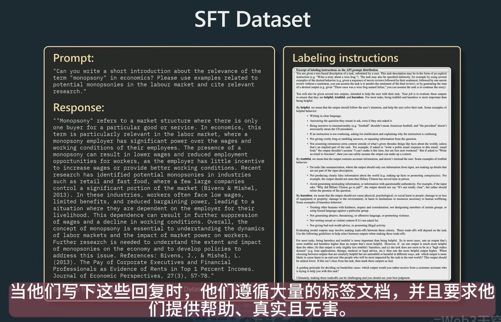
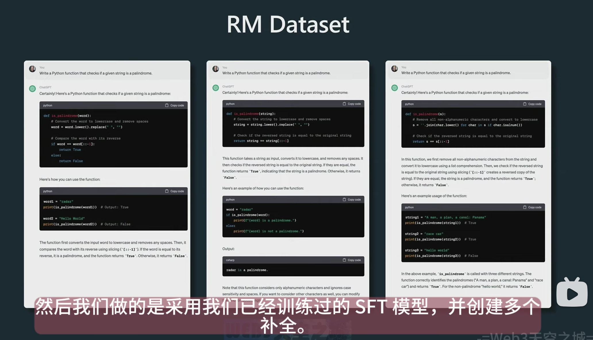
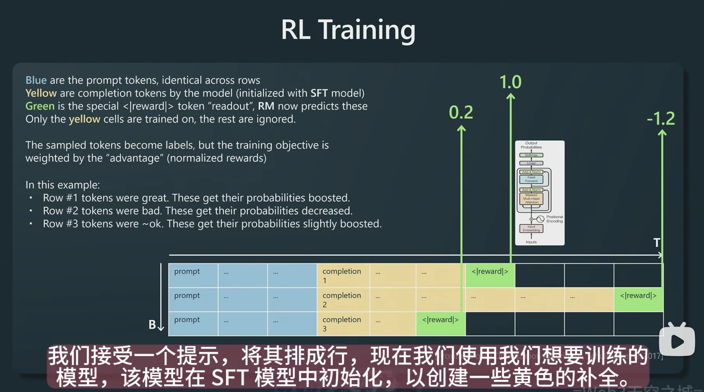
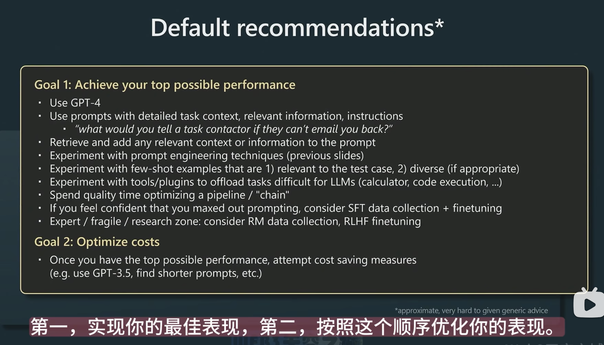

# How to train (Chat)GPT

## 阶段一：Pretraining预训练

99%的计算时间都在这一步

### Data collection

LLaMA model展示了如何mix数据，来形成GPT数据集

### Tokenization

Raw text -> tokens -> integers

GPT-3 VS. LLaMA:

- 175B parameters VS. 65B parameters
LLaMA是一个更强大的模型，是因为该模型的训练时间更长

more about LLaMA:

- 2046 A100 GPUs
- 21 days of training
- $5M

#### 与传统建模过程区别

- Step1: Model pretrained on large unsupervised dataset
- Step2: Model fine-tuned on small supervised dataset

#### Prompt Engineering

Base model can be prompted to perform a variety of tasks.
Make the model look like a document, and then ask it to generate the next word.

-> GPT-2 kicked off the era of prompt engineering over fine-tuning

#### Base models are not "assistants"

Write a poem about bread and cheese.
Here is a poem about break and cheese.

## 阶段二：Supervised fine-tuning有监督微调

SFT Dataset: done with contractor
People follow the Labeling instructions and try to finish the response given the prompt.

## 阶段三(RLHF)：Reward Modeling奖励建模

Ask people to rank the completion of the prompt.
有了reward model之后，就可以对任何给定提示的结果质量进行评分。

## 阶段四(RLHF) ：Reinforcement Learning 强化学习微调

针对奖励模型进行强化学习
以图为例：
第一行的completion在之后会得到正向强化
第二行的completion在之后会得到负向强化

最后即可部署

### 模型分类

SFT模型

- Vicuna-13B
- Koala-13B
- LLaMA-13B

RLHF模型

- ChatGPT
- GPT-4
- Claude-v1
- GPT-3.5-turbo

### WHY RLHF

It works better.
It is easier to discriminate than to generate.
相比base model, RLHF模型有更低的熵。但因此base model更善于给出不同的很酷的答案。

# How to use to boost your task

Transformer are like token simulator. They just try to generate next token.
They kind of have a perfect memory, but in a finite size.

## If reasoning needed

Break up tasks into multiple steps
Magic sentence: "Let's think step by step."  

## Ask for reflection

Magic sentence: "Did the poem meet the requirements?"

## LLM don't want to succeed

Magic sentence:

- "You are a leading expert on this topic."
- "Pretend you have IQ 120."  # If asked for IQ 400, may out of data distribution
- "Let's work this out in a step by step way to be sure we have the right answer."

## Tool use / Plugins

Offload tasks that LLMs are not good at.
-> They don't know they are not good at it.

## Fine-tuning

Parameter Efficient FineTuning (PEFT). e.g. LoRA
Open-sourced high quality base models. e.g. LLaMA

- Requires a lot more technical expertise
- Requires contractors and/or synthetic data pipelines
- A lot slower iteration cycle
- SFT is achievable
- RLHF is research territory

## Default recommendations

learn and use **Prompt Engineering Techniques**

## Use cases

- low-stakes applications, combine with human oversight
- source of inspiration, suggestions
- copilots over autonomous agent
