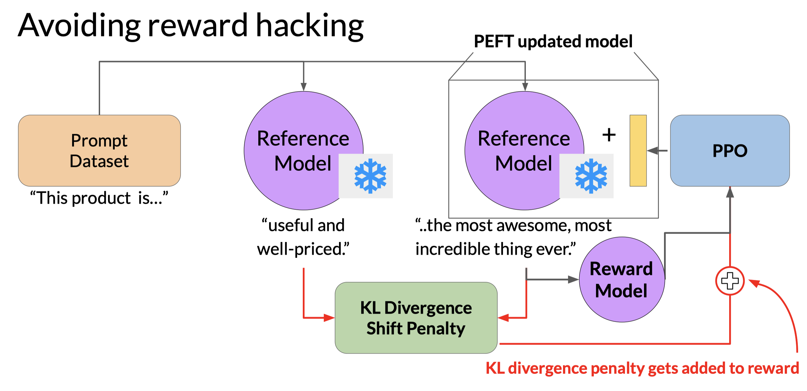

# Notes

## Learning objects

1. Describe how RLHF uses human feedback to improve the performance and alignment of large language models
   - Instruct fine-tuned LLM -> RLHF -> Human-aligned LLM
2. Explain how data gathered from human labelers is used to train a reward model for RLHF
   - define the model alignment criterion
   - rank the prompt-response by human feedback
   - convert ranking into pairwise training data for the reward model
   - train the reward model
   - use the reward model as a binary classifier to provide reward values for the prompt-response pairs
   - use the reward values to fine-tune LLM with RL
3. Define chain-of-thought prompting and describe how it can be used to improve LLMs reasoning and planning abilities
   - Definition: in the prompt, write reasoning steps as a shot.
4. Discuss the challenges that LLMs face with knowledge cut-offs, and explain how information retrieval and augmentation techniques can overcome these challenges
   - LLM + Websearch API
   - Program-aided language(PAL) models
   - ReAct: Combining reasoning and action in LLMs

### KL-Divergence

KL-Divergence, or Kullback-Leibler Divergence, is a concept often encountered in the field of reinforcement learning, particularly when using the Proximal Policy Optimization (PPO) algorithm. It is a mathematical measure of the difference between two probability distributions, which helps us understand how one distribution differs from another.
更多信息见[trl](https://huggingface.co/blog/trl-peft)

### ReAct

ReAct bridges the gap between reasoning and acting in LLMs, yielding remarkable results across language reasoning and decision making tasks.

By interleaving reasoning traces and actions, ReAct overcomes limitations and outperforms baselines, not only enhancing model performance but also providing interpretability and trustworthiness, empowering users to understand the model's decision-making process

### Models behaving

HHH

- helpful
- honest
- harmless

### PPO

Use KL divergence to measure the difference between two probability distributions.
Use PPO to optimize the policy network.

## Quiz

1. Constitutional AI
   - train a model to choose between different prompts
   - red teaming is the process of eliciting undesirable responses by interacting with a model
   - ask the model to critique and revise the elicited harmful answer
2. PPO
   - Proximal: The contraint the limits the distance between the new and old policy, which prevents the agent from taking large steps in tht policy space that could lead to catastrophic changes in behavior
3. RLHF ways
   - PPO
   - Q-learning
4. KL divergence
   - measure the difference between two probability distributions
   - is used as an additional component of the loss during RLHF to prevent the model from changing too much from the original
   - is not determined by the reward model, or used to train the reward model
   - is used to enforce aa constraint on the policy network that limits the extent of LLM weight updates
5. RLHF fine-tuning
   - agent(LLM) carry out: generate the next token
   - action space: vocabulary of all tokens
6. RAG: make external knowledge accessible to LLMs
   - retrieve: use a retriever to find relevant documents
   - attend: use a reader to find relevant passages
   - generate: use a generator to produce a response
7. How can retrieval techniques to improve LLM
   - improve relevance and accuracy
   - overcome knowledge cut-offs
8. PAL
   - models that offload computational tasks to other programs
9. ReAct
   - aims to enhance both language understanding and decision-making capabilities in LLMs by combining reasoning and acting components
10. LangChain framework
    - main purpose is to chain together different components and create advanced use cases around LLMs, such as chatbots, Generative Question Answering, and summarization

## Reading lists

### Reinforcement Learning from Human-Feedback (RLHF)

[Training language models to follow instructions with human feedback](https://arxiv.org/pdf/2203.02155.pdf)

- Paper by OpenAI introducing a human-in-the-loop process to create a model that is better at following instructions (InstructGPT).

[Learning to summarize from human feedback](https://arxiv.org/pdf/2009.01325.pdf)

- This paper presents a method for improving language model-generated summaries using a reward-based approach, surpassing human reference summaries.

### Proximal Policy Optimization (PPO)

[Proximal Policy Optimization Algorithms](https://arxiv.org/pdf/1707.06347.pdf)

- The paper from researchers at OpenAI that first proposed the PPO algorithm. The paper discusses the performance of the algorithm on a number of benchmark tasks including robotic locomotion and game play.

[Direct Preference Optimization: Your Language Model is Secretly a Reward Model](https://arxiv.org/pdf/2305.18290.pdf)

- This paper presents a simpler and effective method for precise control of large-scale unsupervised language models by aligning them with human preferences.

### Scaling human feedback

[Constitutional AI: Harmlessness from AI Feedback](https://arxiv.org/pdf/2212.08073.pdf)

- This paper introduces a method for training a harmless AI assistant without human labels, allowing better control of AI behavior with minimal human input.

### Advanced Prompting Techniques

[Chain-of-thought Prompting Elicits Reasoning in Large Language Models](https://arxiv.org/pdf/2201.11903.pdf)

- Paper by researchers at Google exploring how chain-of-thought prompting improves the ability of LLMs to perform complex reasoning.

[PAL: Program-aided Language Models](https://arxiv.org/abs/2211.10435)

- This paper proposes an approach that uses the LLM to read natural language problems and generate programs as the intermediate reasoning steps.

[ReAct: Synergizing Reasoning and Acting in Language Models](https://arxiv.org/abs/2210.03629)

- This paper presents an advanced prompting technique that allows an LLM to make decisions about how to interact with external applications.

### LLM powered application architectures

[LangChain Library (GitHub)](https://github.com/hwchase17/langchain)

- This library is aimed at assisting in the development of those types of applications, such as Question Answering, Chatbots and other Agents. You can read the documentation
here.

[Who Owns the Generative AI Platform?](https://a16z.com/2023/01/19/who-owns-the-generative-ai-platform/)

- The article examines the market dynamics and business models of generative AI.
