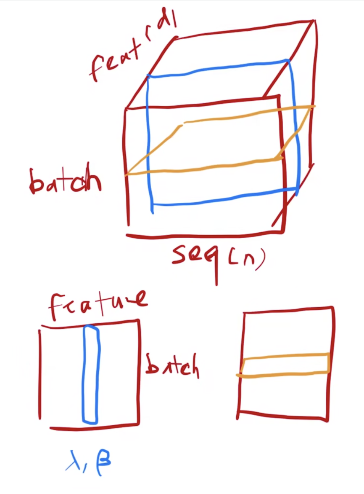
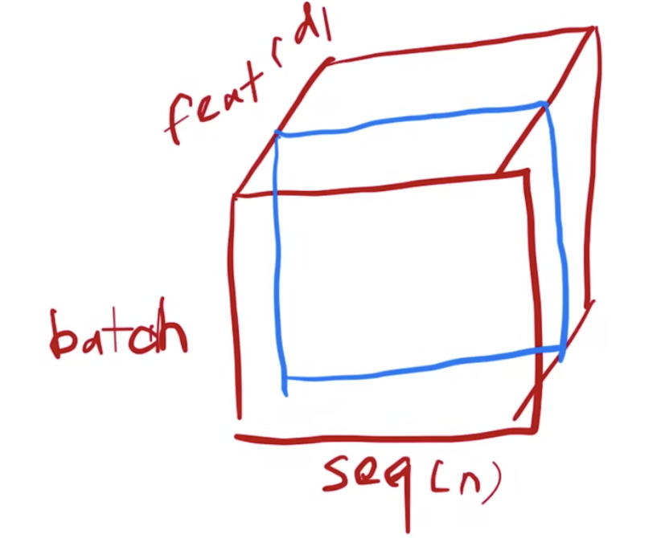
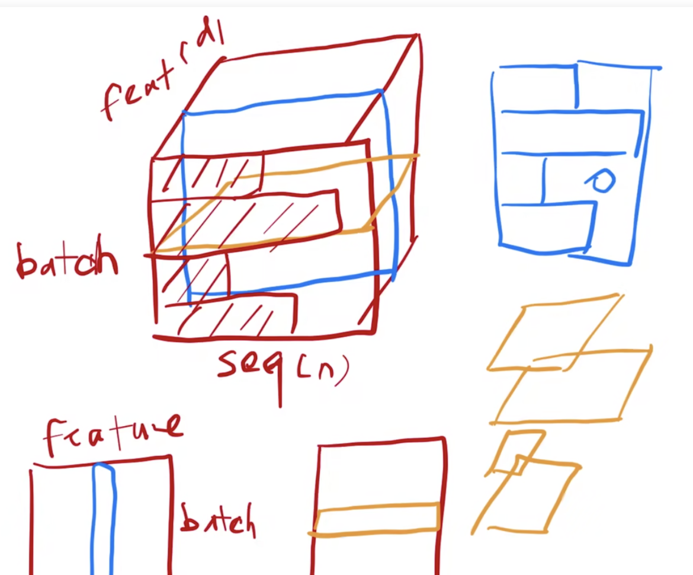
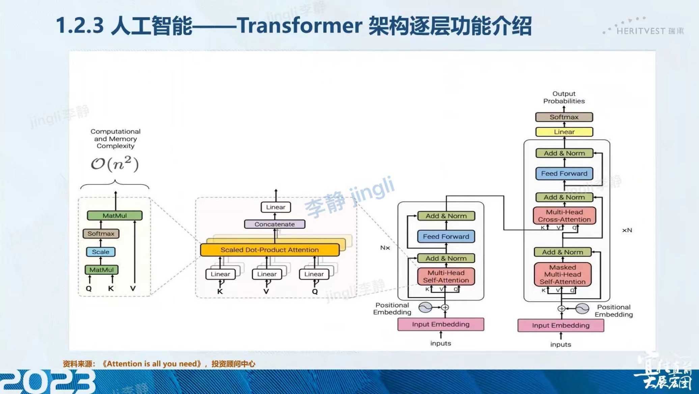

# 图解

# 李沐老师作文精读

## Prerequisite

MLP
Residual connection: 残差连接，见ResNet论文

## Experiment

### 编码器

Layer Normalization: 层归一化，适用于变长序列
对每个样本做归一化，使得每个样本的均值为0，方差为1
二维时候：可以理解成把数据转置，然后算batch norm，然后再转置回去
三维：

layer_norm example(yellow)

Batch Normalization: 批归一化
每次取一个batch的数据（同一个特征），对每个batch的数据进行归一化，使得每个batch的数据的均值为0，方差为1
方法：减掉向量的均值，再除以向量的方差

batch_norm_3d example(blue)

Why layer norm?
每个样本的长度不一样，所以不能用batch norm，只能用layer norm

why_layer_norm
算均值和方差上：

- batch norm: 每个均值和方差的抖动比较大；预测时候来一个特别长的，之前没遇到过，那么就没那么好用
- layer norm：每个样本自己算均值和方差，同时不用存一个全局的

### 解码器

自回归：当前的输入是之前的输出

看到36min，去补充线性代数的知识

