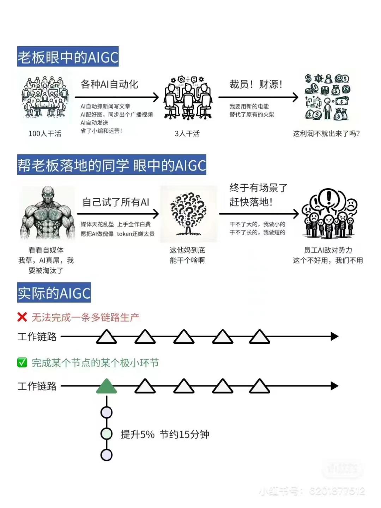

# 大模型应用开发基础

教学理念：
懂AI，懂编程，懂业务的超级个体
这节课能做的：在各个方向上为大家打开一扇门，带大家入门
想走的更深更远，要靠大家自己、社群和AI的进化

三个方向发力：

1. 原理：不懂原理，就不会举一反三，走不了太远
2. 实践：不懂实践，只能纸上谈兵，做事不落地
3. 认知：认知不高，就无法做对决策，天花板太低

哪个最不懂，哪个就最重要。千万别只拿代码当干货

目前行业共识，两个确定一个不确定：

1. 确定的未来：AI必然重构世界
2. 确定进入：想收获红利，必须现在进入
3. 不确定：解决什么需求、技术路线、产品策略都是什么

看知识体系图


建议取舍：

1. 原理要认真学
2. 认知一定要用心领悟，这是这门课最领先的地方
3. 编程或工程经验不足，就别对实战太较劲。受到熏陶就是收获

# 什么是AI

要区分什么是AI系统，什么不是AI系统
基于机器学习、神经网络的是AI，基于规则、搜索的不是AI

# 大模型能干什么

现在，已经不需要再演示了。每人应该都至少和下面一个基于大模型的对话产品，对话过至少 100 次。

下方是推荐使用的模型和产品，标准是做大模型这件事是否是他们的生死之战，大模型是不是他们一定要搞成的事情，以及是否有足够的积累和资源让他们出于领先的地位

| 国家 | 对话产品           | 大模型         | 链接                                                             |
| ---- | ------------------ | -------------- | ---------------------------------------------------------------- |
| 美国 | OpenAI ChatGPT     | GPT-3.5、GPT-4 | [https://chat.openai.com/](https://chat.openai.com/)             |
| 美国 | Microsoft Copilot  | GPT-4 和未知   | [https://copilot.microsoft.com/](https://copilot.microsoft.com/) |
| 美国 | Google Bard        | Gemini         | [https://bard.google.com/](https://bard.google.com/)             |
| 中国 | 百度文心一言       | 文心 4.0       | [https://yiyan.baidu.com/](https://yiyan.baidu.com/)             |
| 中国 | 讯飞星火           | 星火 3.5       | [https://xinghuo.xfyun.cn/](https://xinghuo.xfyun.cn/)           |
| 中国 | 智谱清言           | GLM-4          | [https://chatglm.cn/](https://chatglm.cn/)                       |
| 中国 | 月之暗面 Kimi Chat | Moonshot       | [https://kimi.moonshot.cn/](https://kimi.moonshot.cn/)           |
| 中国 | MiniMax 星野       | abab6          | [https://www.xingyeai.com/](https://www.xingyeai.com/)           |

本课第一个专业向要求：分清**对话产品**和**大模型**。
产品和模型是两件事情，产品是商业模式，模型是技术路线。

工作举例：

- **舆情分析：**从公司产品的评论中，分析哪些功能/元素是用户讨论最多的，评价是正向还是负向
- **坐席质检：**检查客服/销售人员与用户的对话记录，判断是否有争吵、辱骂、不当言论，话术是否符合标准
- **知识库：**让大模型基于私有知识回答问题
- **零代码开发/运维：**自动规划任务，生成指令，自动执行
- **AI 编程：**用 AI 编写代码，提升开发效率

当下，如何发挥大模型的现有能力呢？最大障碍是没有形成认知对齐。



<div class="alert alert-success">
<b>找落地场景的思路：</b>
<ol>
<li>从最熟悉的领域入手</li>
<li>让 AI 学最厉害员工的能力，再让 ta 辅助其他员工，实现降本增效</li>
<li>找「文本进、文本出」的场景</li>
<li>别求大而全。将任务拆解，先解决小任务、小场景（周鸿祎：「小切口，大纵深」）</li>
</ol>
</div>

原理

这套生成机制的内核叫「Transformer 架构」。但其实，transformer 已经不是最先进的了。

| 架构        | 设计者                                               | 特点                                     | 链接                                                                                                   |
| ----------- | ---------------------------------------------------- | ---------------------------------------- | ------------------------------------------------------------------------------------------------------ |
| Transformer | Google                                               | 最流行，几乎所有大模型都用它             | [OpenAI 的代码](https://github.com/openai/finetune-transformer-lm/blob/master/train.py)                |
| RWKV        | [PENG Bo](https://www.zhihu.com/people/bopengbopeng) | 可并行训练，推理性能极佳，适合在端侧使用 | [官网](https://www.rwkv.com/)、[RWKV 5 训练代码](https://github.com/BlinkDL/RWKV-LM/tree/main/RWKV-v5) |
| Mamba       | CMU & Princeton University                           | 性能更佳，尤其适合长文本生成             | [GitHub](https://github.com/state-spaces/mamba)                                                        |

## 五、用好 AI 的核心心法

OpenAI 首席科学家 Ilya Sutskever 说过：

> 数字神经网络和人脑的生物神经网络，在数学原理上是一样的。

和人很像，所以也继承了人的缺点。比如，我们人类有时候会犯错，AI 也会犯错。

所以，我们要：

<div class="alert alert-success">
把 AI 当人看。<br>
把 AI 当人看。<br>
把 AI 当人看。
</div>

我和凯文·凯利交流时，他说了类似的观点：「和人怎么相处，就和 AI 怎么相处。」

1. 用「当人看」来理解 AI
2. 用「当人看」来控制 AI
3. 用「当人看」来说服用户正确看待 AI 的不足

这是贯彻整门课，甚至我们与 AI 为伴的生涯的心法。

先将文字输入到tokenizer模型里，输出结果就是token，然后使用embedding模型将token转化为高维向量

大模型应用技术特点：门槛低，天花板高

### 6.1、典型业务架构


Agent 还太超前，Copilot 值得追求。

### 6.2、技术架构

#### 1 - 纯 Prompt

就像和一个人对话，你说一句，ta 回一句，你再说一句，ta 再回一句……


#### 2 - Agent + Function Calling

- Agent：AI 主动提要求
- Function Calling：AI 要求执行某个函数
- 场景举例：你问过年去哪玩，ta 先反问你有多少预算


#### 3 - RAG（Retrieval-Augmented Generation）

- Embeddings：把文字转换为更易于相似度计算的编码。这种编码叫**向量**
- 向量数据库：把向量存起来，方便查找
- 向量搜索：根据输入向量，找到最相似的向量
- 场景举例：考试时，看到一道题，到书上找相关内容，再结合题目组成答案。然后，就都忘了


#### 4 - Fine-tuning

努力学习考试内容，长期记住，活学活用。


### 如何选择技术路线

面对一个需求，如何选择技术方案？下面是个不严谨但常用思路。


值得尝试 Fine-tuning 的情况：

1. 提高大模型的稳定性
2. 用户量大，降低推理成本的意义很大
3. 提高大模型的生成速度

基础模型选型，也是个重要因素。合规和安全是首要考量因素。

| 需求             | 国外大模型 | 国产大模型 | 开源大模型 |
| ---------------- | ---------- | ---------- | ---------- |
| 国内 2C          | 🛑         | ✅         | ✅         |
| 国内 2G          | 🛑         | ✅         | ✅         |
| 国内 2B          | ✅         | ✅         | ✅         |
| 出海             | ✅         | ✅         | ✅         |
| 数据安全特别重要 | 🛑         | 🛑         | ✅         |

然后用测试数据，在可以选择的模型里，做测试，找出最优。

```python

from openai import OpenAI

# 加载 .env 文件到环境变量
from dotenv import load_dotenv, find_dotenv
_ = load_dotenv(find_dotenv())

# 初始化 OpenAI 服务。会自动从环境变量加载 OPENAI_API_KEY 和 OPENAI_BASE_URL
client = OpenAI()

# 消息
messages = [
    {
        "role": "system",
        "content": "你是AI助手小瓜，是 AGI 课堂的助教。这门课每周二、四上课。"  # 注入新知识
    },
    {
        "role": "user",
        "content": "周一上课吗？"  # 问问题。可以改改试试
    },

]

# 调用 GPT-3.5
chat_completion = client.chat.completions.create(
    model="gpt-3.5-turbo",
    messages=messages
)

# 输出回复
print(chat_completion.choices[0].message.content)

```

看到103min，开始课堂的答疑
