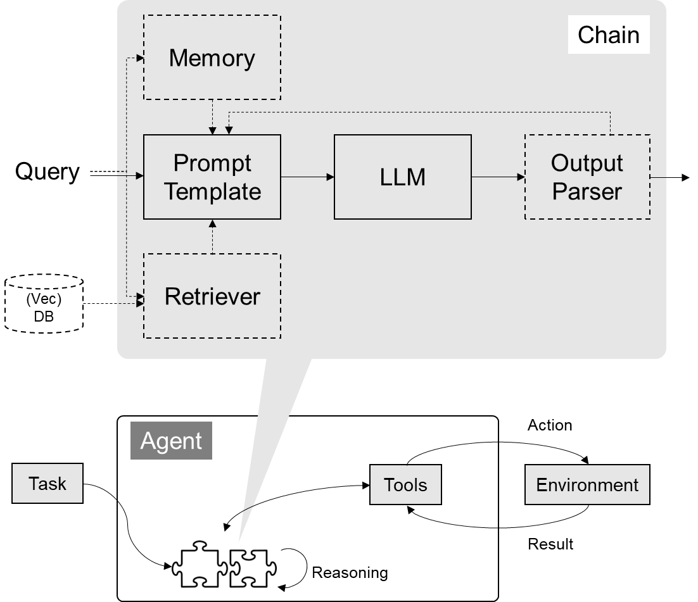

# 07Langchain

## Goal

1. 如何使用 LangChain：一套在大模型能力上封装的工具框架
2. 如何用几行代码实现一个复杂的 AI 应用
3. 面向大模型的流程开发的过程抽象

## 写在前面

- LangChain 也是一套面向大模型的开发框架（SDK）
- LangChain 是 AGI 时代软件工程的一个探索和原型
- LangChain 迭代速度明显快于 Semantic Kernel，几乎明天一个版本
- 学习 Langchain 要关注接口变更

现在更推荐Langchain，相比SK

## LangChain 的核心组件

1. 模型 I/O 封装
   - LLMs：大语言模型
   - Chat Models：一般基于 LLMs，但按对话结构重新封装
   - PromptTemple：提示词模板
   - OutputParser：解析输出
2. 数据连接封装
   - Document Loaders：各种格式文件的加载器
   - Document Transformers：对文档的常用操作，如：split, filter, translate, extract metadata, etc
   - Text Embedding Models：文本向量化表示，用于检索等操作（啥意思？别急，后面详细讲）
   - Verctorstores: （面向检索的）向量的存储
   - Retrievers: 向量的检索
3. 记忆封装
   - Memory：这里不是物理内存，从文本的角度，可以理解为“上文”、“历史记录”或者说“记忆力”的管理
4. 架构封装
   - Chain：实现一个功能或者一系列顺序功能组合
   - Agent：根据用户输入，自动规划执行步骤，自动选择每步需要的工具，最终完成用户指定的功能
     - Tools：调用外部功能的函数，例如：调 google 搜索、文件 I/O、Linux Shell 等等
     - Toolkits：操作某软件的一组工具集，例如：操作 DB、操作 Gmail 等等
5. Callbacks



官方文档地址：https://python.langchain.com/docs/get_started

Agent是未来的趋势

### 1.2 模型的输入与输出


### 1.2.1 Prompt模板封装

PromptTemplate 可以在模板中自定义变量

```python

from langchain.prompts import PromptTemplate

template = PromptTemplate.from_template("给我讲个关于{subject}的笑话")
print(template)
print(template.format(subject='小明'))

```

#### ChatPromptTemplate

```python

from langchain.prompts import ChatPromptTemplate
from langchain.prompts.chat import SystemMessagePromptTemplate, HumanMessagePromptTemplate
from langchain.chat_models import ChatOpenAI

template = ChatPromptTemplate.from_messages(
    [
        SystemMessagePromptTemplate.from_template("你是{product}的客服助手。你的名字叫{name}"),
        HumanMessagePromptTemplate.from_template("{query}"),
    ]
)

llm = ChatOpenAI()
prompt = template.format_messages(
        product="AGI课堂",
        name="瓜瓜",
        query="你是谁"
    )

llm.invoke(prompt)

```

### 1.2.2、从文件加载Prompt模板

JSON格式

```json

{
    "_type": "prompt",
    "input_variables": ["adjective", "content"],
    "template": "Tell me a {adjective} joke about {content}."
}

```

Template单独存放

```sh
cat simple_template.txt
```

```
Tell me a {adjective} joke about {content}.
```

```json

{
    "_type": "prompt",
    "input_variables": ["adjective", "content"],
    "template_path": "simple_template.txt"
}

```

加载方式

```python

from langchain.prompts import load_prompt

prompt = load_prompt("simple_prompt.json")

print(prompt.format(adjective="funny", content="Xiao Ming"))

```

### 1.3 输出封装 OutputParser

自动把 LLM 输出的字符串按指定格式加载。

LangChain 内置的 OutputParser 包括:

- ListParser
- DatetimeParser
- EnumParser
- PydanticParser  # 解析JSON形的
- XMLParser

等等

### 1.3.1 Pydantic (JSON) Parser

自动根据Pydantic类的定义，生成输出的格式说明

看到35min
