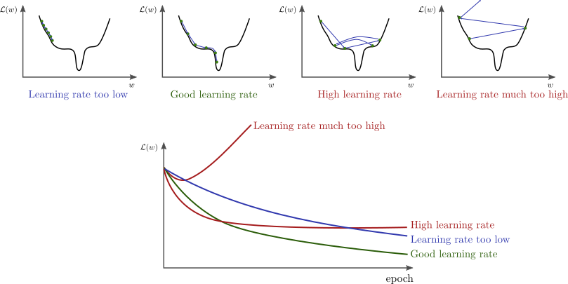

# 模型微调上

1. 这堂课内容有难度：
   1. 有很多陌生的名词，包括数学名词和模型算法本身的名词
   2. 涉及到很多数学知识，很多东西本身是从数学推导出来的，不好具象化
   3. 深度学习里有大量基于经验的总结，体现成各种超参和 Tricks
2. 这堂课该怎么学：
   1. 注意力集中，跟上我的思路
   2. 遇到不懂的地方，别害怕，先尝试思考
   3. 实现想不明白也别灰心，这个领域的能力积累是需要时间的
   4. 真感兴趣的同学，尝试多度论文，“书读百遍其义自见”的道理我亲自验证过
3. **深度学习是基于数学的经验科学**
   1. 程序员思维：IF...ELSE... *“你就告诉我遇到这个情况怎么办”*
   2. 算法工程师思维：$P(办法|情况)$ *“这个情况**大概率**你可以**尝试**XXX”*
4. 深度学习这个领域就像攀珠峰
   1. 不存在捷径，至少目前还没有
   2. 根据自身条件，见到风景、攀上一座小峰、超越自己原来的高度，都是收获！加油！

面向初学者的深度学习课：

吴恩达《人人 AI》(特别通俗) <https://www.zhihu.com/education/video-course/1556316449043668992>
李沐的深度学习课 (稍微深一点) <https://www.zhihu.com/education/video-course/1647604835598092705>

在这个更广泛的定位上，已经有很多优秀的课程。本课程只针对大模型微调的知识基础展开。

# 什么时候需要微调模型

1. 有私有部署的需求
2. 开源模型原生的能力不满足业务需求

# demo

可以打麻将的酒店 -> 有棋牌室的酒店

LLaMa2没有function calling的能力，可以通过微调模型来实现

## 操作流程


1. 导入相关的库

```python
import datasets
from datasets import load_dataset
from transformers import AutoTokenizer, AutoModel
from transformers import AutoModelForCausalLM
from transformers import TrainingArguments, Seq2SeqTrainingArguments
from transformers import Trainer, Seq2SeqTrainer
import transformers
from transformers import DataCollatorWithPadding
from transformers import TextGenerationPipeline
import torch
import numpy as np
import os, re
from tqdm import tqdm
import torch.nn as nn
```

2. 加载数据集

```python
# 数据集名称
DATASET_NAME = "rotten_tomatoes" 

# 加载数据集
raw_datasets = load_dataset(DATASET_NAME)

# 训练集
raw_train_dataset = raw_datasets["train"]

# 验证集
raw_valid_dataset = raw_datasets["validation"]
```

3. 加载模型

```python
# 模型名称
MODEL_NAME = "gpt2" 

# 加载模型 
model = AutoModelForCausalLM.from_pretrained(MODEL_NAME,trust_remote_code=True)
```

4. 加载tokenizer

```python
# 加载tokenizer
tokenizer = AutoTokenizer.from_pretrained(MODEL_NAME,trust_remote_code=True)
tokenizer.add_special_tokens({'pad_token': '[PAD]'})
tokenizer.pad_token_id = 0
```

```python
# 其它相关公共变量赋值

# 设置随机种子：同个种子的随机序列可复现
transformers.set_seed(42)

# 标签集
named_labels = ['neg','pos']

# 标签转 token_id
label_ids = [
    tokenizer(named_labels[i],add_special_tokens=False)["input_ids"][0] 
    for i in range(len(named_labels))
]
```

5. **处理数据集**：转成模型接受的输入格式，每个模型都不一样
   - 拼接输入输出：\<INPUT TOKEN IDS\>\<EOS_TOKEN_ID\>\<OUTPUT TOKEN IDS\>
   - PAD成相等长度：
      - <INPUT 1.1><INPUT 1.2>...\<EOS_TOKEN_ID\>\<OUTPUT TOKEN IDS\>\<PAD\>...\<PAD\>
      - <INPUT 2.1><INPUT 2.2>...\<EOS_TOKEN_ID\>\<OUTPUT TOKEN IDS\>\<PAD\>...\<PAD\>
   - 标识出参与 Loss 计算的 Tokens (只有输出 Token 参与 Loss 计算)
      - \<-100\>\<-100\>...\<OUTPUT TOKEN IDS\>\<-100\>...\<-100\>

```python
MAX_LEN=32   #最大序列长度（输入+输出）
DATA_BODY_KEY = "text" # 数据集中的输入字段名
DATA_LABEL_KEY = "label" #数据集中输出字段名

# 定义数据处理函数，把原始数据转成input_ids, attention_mask, labels
def process_fn(examples):
    model_inputs = {
            "input_ids": [],
            "attention_mask": [],
            "labels": [],
        }
    for i in range(len(examples[DATA_BODY_KEY])):
        inputs = tokenizer(examples[DATA_BODY_KEY][i],add_special_tokens=False)
        label = label_ids[examples[DATA_LABEL_KEY][i]]
        input_ids = inputs["input_ids"] + [tokenizer.eos_token_id, label]
        
        raw_len = len(input_ids)
        input_len = len(inputs["input_ids"]) + 1

        if raw_len >= MAX_LEN:
            input_ids = input_ids[-MAX_LEN:]
            attention_mask = [1] * MAX_LEN
            labels = [-100]*(MAX_LEN - 1) + [label]
        else:
            input_ids = input_ids + [tokenizer.pad_token_id] * (MAX_LEN - raw_len)
            attention_mask = [1] * raw_len + [0] * (MAX_LEN - raw_len)
            labels = [-100]*input_len + [label] + [-100] * (MAX_LEN - raw_len)
        model_inputs["input_ids"].append(input_ids)
        model_inputs["attention_mask"].append(attention_mask)
        model_inputs["labels"].append(labels)
    return model_inputs
```

```python
# 处理训练数据集
tokenized_train_dataset = raw_train_dataset.map(
    process_fn,
    batched=True,
    remove_columns=raw_train_dataset.columns,
    desc="Running tokenizer on train dataset",
)

# 处理验证数据集
tokenized_valid_dataset = raw_valid_dataset.map(
    process_fn,
    batched=True,
    remove_columns=raw_valid_dataset.columns,
    desc="Running tokenizer on validation dataset",
)
```

6. 定义数据规整器，训练时自动将数据拆分成 Batch

```python
# 定义数据校准器（自动生成batch）
collater = DataCollatorWithPadding(
    tokenizer=tokenizer, return_tensors="pt",
)
```

7. 定义训练超参数

```python
LR=2e-5         # 学习率
BATCH_SIZE=8    # Batch大小
INTERVAL=100    # 每多少步打一次 log / 做一次 eval

# 定义训练参数
training_args = TrainingArguments(
    output_dir="./output",              # checkpoint保存路径
    evaluation_strategy="steps",        # 按步数计算eval频率
    overwrite_output_dir=True,
    num_train_epochs=1,                 # 训练epoch数
    per_device_train_batch_size=BATCH_SIZE,     # 每张卡的batch大小
    gradient_accumulation_steps=1,              # 累加几个step做一次参数更新
    per_device_eval_batch_size=BATCH_SIZE,      # evaluation batch size
    eval_steps=INTERVAL,                # 每N步eval一次
    logging_steps=INTERVAL,             # 每N步log一次
    save_steps=INTERVAL,                # 每N步保存一个checkpoint
    learning_rate=LR,                   # 学习率
)
```

8. 定义训练器

```python
# 节省显存
model.gradient_checkpointing_enable()

# 定义训练器
trainer = Trainer(
    model=model, # 待训练模型
    args=training_args, # 训练参数
    data_collator=collater, # 数据校准器
    train_dataset=tokenized_train_dataset,  # 训练集
    eval_dataset=tokenized_valid_dataset,   # 验证集
    # compute_metrics=compute_metric,         # 计算自定义评估指标
)
```

9. 开始训练

```python
# 开始训练
trainer.train()
```

### 总结上述过程

1. 加载数据集
2. 数据预处理：
   - 将输入输出按特定格式拼接
   - 文本转 Token IDs
   - 通过 labels 标识出哪部分是输出（只有输出的 token 参与 loss 计算）
4. 加载模型
5. 加载Tokenizer
6. 定义数据规整器
7. 定义训练超参：学习率、批次大小、...
8. 定义训练器
9. 开始训练

记住上面的流程，你就能跑通模型训练过程
理解下面的知识，你就能训练好模型效果

# 什么是模型

### 2.1、通俗（不严谨）的说、**模型**是一个函数

$y=F(x;\omega)$

- 它接收输入$x$：可以是一个词、一个句子、一篇文章或图片、语音、视频 ...
  - 这些物体都被表示成一个数学「矩阵」（其实应该叫张量，tensor）
- 它预测输出$y$
  - 可以是「是否」（{0,1}）、标签（{0,1,2,3...}）、一个数值（回归问题）、下一个词的概率 ...
- 它的表达式就是网络结构（这里特指深度学习）
- 它有一组**参数** $\omega$，这就是我们要训练的部分

把它想象成一个方程：

- 每条数据就是一对儿 $(x,y)$ ，它们是常量
- 参数是未知数，是变量
- $F$ 就是表达式：我们不知道真实的公式是什么样的，所以假设了一个足够复杂的公式（比如，一个特定结构的神经网络）
- 这个求解这个方程（近似解）就是训练过程

### 2.2、简单的神经网络

一个神经元：$y=f(\sum_i w_i\cdot x_i)$


现今的大模型中常用的激活函数包括：ReLU、GELU、Swish

ReLU快，效果也挺好的

大模型领域，用的最多的是GELU和Swish

GPT用的是GELU
GLM用的是Swish


## 3、什么是模型训练

我们希望找到一组参数$\omega$，使模型预测的输出$\hat{y}=F(x;\omega)$与真实的输出$y$，尽可能的接近

这里，我们（至少）需要两个要素：

- 一个数据集，包含$N$个输入输出的例子（称为样本）：$D=\{(x_i,y_i)\}_{i=1}^N$
- 一个**损失函数**，衡量模型预测的输出与真实输出之间的差距：$\mathrm{loss}(y,F(x;\omega))$

### 3.1、模型训练本质上是一个求解最优化问题的过程

$\min_{\omega} L(D,\omega)$

$L(D,\omega)=\frac{1}{N}\sum_{i=1}^N\mathrm{loss}(y,F(x;\omega))$

在我的数据集上，什么条件下的L最小

### 3.2、梯度下降

从最简单的情况说起：梯度下降与凸问题


梯度决定了函数变化的方向，每次迭代更新我们会收敛到一个极值

$\omega_{n+1}\leftarrow \omega_n - \gamma \nabla_{\omega}L(D,\omega)$

其中，$\gamma<1$叫做**学习率**，它和梯度的模数共同决定了每步走多远

### 3.3、**现实总是没那么简单（1）**：在整个数据集上求解梯，计算量太大了

经验：

- 如果全量参数训练：条件允许的情况下，先尝试Batch Size大些
- 小参数量微调：Batch Size 大不一定就好，看稳定性

### 3.4、**现实总是没那么简单（2）**：深度学习没有全局最优解（非凸问题）

有大量的鞍点和拐点


找不到全局最优解

### 3.5、**现实总是没那么简单（3）**：学习率也很关键，甚至需要动态调整



划重点：适当调整学习率（Learning Rate），避免陷入很差的局部解或者跳过了好的解

## 四、求解器

上一节提到的SDG梯度下降法是最简单的求解器，为了让训练过程更好的收敛，为了千沟万壑能更好找到最优点，人们设计了很多更复杂的求解器。

本质上还是梯度下降这个过程，只是在梯度下降的过程中加入了一些东西

- 比如：SGD、L-BFGS、Rprop、RMSprop、Adam、AdamW、AdaGrad、AdaDelta 等等
- 但是，好在对于Transformer最常用的就是 Adam 或者 AdamW

一般就先使用AdamW，如果效果不好，再尝试Adam

Rprop、RMSprop是求解RNN的

## 五、一些常用的**损失函数**

要重点掌握，和模型的任务强相关。

- 两个数值的差距，Mean Square Error：$\ell_{\mathrm{MSE}}=\frac{1}{N}\sum_{i=1}^N(y_i-\hat{y}_i)^2$ (等价于欧式距离，见下文)（比如应用在股票数值预测问题）
- 两个向量之间的（欧式）距离：$\ell(\mathbf{y},\mathbf{\hat{y}})=\|\mathbf{y}-\mathbf{\hat{y}}\|$ （比如应用在embedding模型的训练）
- 两个向量之间的夹角（余弦距离）： （比如应用在embedding模型的训练）


- 两个概率分布之间的差异，交叉熵：$\ell_{\mathrm{CE}}(p,q)=-\sum_i p_i\log q_i$ ——假设是概率分布 p,q 是离散的 （大语言模型的训练。标签是0，1，预测结果是一个概率分布，本质上等价于一个极大似然）
- 这些损失函数也可以组合使用（在模型蒸馏的场景常见这种情况），例如$L=L_1+\lambda L_2$，其中$\lambda$是一个预先定义的权重，也叫一个「超参」

思考：

你能找到这些损失函数和分类、聚类、回归问题之间的关系吗？

-> 分类问题：交叉熵
-> 回归问题：均方误差
-> 聚类问题：余弦距离

本质上问题的类型是由Loss Function决定的

## 上手实践

用 PyTorch 训练一个最简单的神经网络

输入一张 28×28 的图像，输出标签 0--9

```python

```python
from __future__ import print_function
import torch
import torch.nn as nn
import torch.nn.functional as F
import torch.optim as optim
from torchvision import datasets, transforms
from torch.optim.lr_scheduler import StepLR

BATCH_SIZE = 64
TEST_BACTH_SIZE = 1000
EPOCHS = 15  # 对整个数据集训练15次
LR = 0.01
SEED = 42
LOG_INTERVAL = 100

# 定义一个全连接网络
class FeedForwardNet(nn.Module):
    def __init__(self):
        super().__init__()
        # 第一层784维输入、256维输出 -- 图像大小28×28=784
        self.fc1 = nn.Linear(784, 256)
        # 第二层256维输入、128维输出
        self.fc2 = nn.Linear(256, 128)
        # 第三层128维输入、64维输出
        self.fc3 = nn.Linear(128, 64)
        # 第四层64维输入、10维输出 -- 输出类别10类（0,1,...9）
        self.fc4 = nn.Linear(64, 10)

        # Dropout module with 0.2 drop probability
        self.dropout = nn.Dropout(p=0.2)

    def forward(self, x):
        """推理的计算过程
        
        Args:
            x: 输入数据，shape为(batch_size, 1, 28, 28)，是28 * 28的矩阵
        """
        # 把输入展平成1D向量
        x = x.view(x.shape[0], -1)  # 784维的向量

        # 每层激活函数是ReLU，额外加dropout
        x = self.dropout(F.relu(self.fc1(x)))  # 先线性变换，再（非线形）激活
        x = self.dropout(F.relu(self.fc2(x)))
        x = self.dropout(F.relu(self.fc3(x)))

        # 输出为10维概率分布
        x = F.log_softmax(self.fc4(x), dim=1)  # log_softmax 是交叉熵损失的输出层，把10层的输出转成概率分布

        return x

# 训练过程
def train(model, loss_fn, device, train_loader, optimizer, epoch):
    # 开启梯度计算
    model.train()
    for batch_idx, (data_input, true_label) in enumerate(train_loader):
        # 从数据加载器读取一个batch
        # 把数据上载到GPU（如有）
        data_input, true_label = data_input.to(device), true_label.to(device)
        # 求解器初始化（每个batch初始化一次）
        optimizer.zero_grad()
        # 正向传播：模型由输入预测输出
        output = model(data_input)
        # 计算loss
        loss = loss_fn(output, true_label) 
        # 反向传播：计算当前batch的loss的梯度
        loss.backward()
        # 由求解器根据梯度更新模型参数
        optimizer.step()

        # 间隔性的输出当前batch的训练loss
        if batch_idx % LOG_INTERVAL == 0:
            print('Train Epoch: {} [{}/{} ({:.0f}%)]\tLoss: {:.6f}'.format(
                epoch, batch_idx * len(data_input), len(train_loader.dataset),
                100. * batch_idx / len(train_loader), loss.item()))


# 计算在测试集的准确率和loss
def test(model, loss_fn, device, test_loader):
    model.eval()
    test_loss = 0
    correct = 0
    with torch.no_grad():
        for data, target in test_loader:
            data, target = data.to(device), target.to(device)
            output = model(data)
            # sum up batch loss
            test_loss += loss_fn(output, target, reduction='sum').item()
            # get the index of the max log-probability
            pred = output.argmax(dim=1, keepdim=True)
            correct += pred.eq(target.view_as(pred)).sum().item()

    test_loss /= len(test_loader.dataset)

    print('\nTest set: Average loss: {:.4f}, Accuracy: {}/{} ({:.0f}%)\n'.format(
        test_loss, correct, len(test_loader.dataset),
        100. * correct / len(test_loader.dataset)))


def main():
    # 检查是否有GPU
    use_cuda = torch.cuda.is_available()

    # 设置随机种子（以保证结果可复现）
    torch.manual_seed(SEED)

    # 训练设备（GPU或CPU）
    device = torch.device("cuda" if use_cuda else "cpu")

    # 设置batch size
    train_kwargs = {'batch_size': BATCH_SIZE}
    test_kwargs = {'batch_size': TEST_BACTH_SIZE}

    if use_cuda:
        cuda_kwargs = {'num_workers': 1,
                       'pin_memory': True,
                       'shuffle': True}
        train_kwargs.update(cuda_kwargs)
        test_kwargs.update(cuda_kwargs)

    # 数据预处理（转tensor、数值归一化），与数据集强相关
    transform = transforms.Compose([
        transforms.ToTensor(),
        transforms.Normalize((0.1307,), (0.3081,))
    ])

    # 自动下载MNIST数据集
    dataset_train = datasets.MNIST('data', train=True, download=True,
                                   transform=transform)
    dataset_test = datasets.MNIST('data', train=False,
                                  transform=transform)

    # 定义数据加载器（自动对数据加载、多线程、随机化、划分batch、等等）
    train_loader = torch.utils.data.DataLoader(dataset_train, **train_kwargs)
    test_loader = torch.utils.data.DataLoader(dataset_test, **test_kwargs)

    # 创建神经网络模型
    model = FeedForwardNet().to(device)

    # 指定求解器
    optimizer = optim.SGD(model.parameters(), lr=LR)
    # scheduler = StepLR(optimizer, step_size=1, gamma=0.9)

    # 定义loss函数
    # 注：nll 作用于 log_softmax 等价于交叉熵，感兴趣的同学可以自行推导
    # https://blog.csdn.net/weixin_38145317/article/details/103288032
    loss_fn = F.nll_loss

    # 训练N个epoch
    for epoch in range(1, EPOCHS + 1):
        train(model, loss_fn, device, train_loader, optimizer, epoch)
        test(model, loss_fn, device, test_loader)  
        # scheduler.step()


if __name__ == '__main__':
    main()
```

## 作业

在 HuggingFace 上找一个简单的数据集，自己实现一个训练过程

## 答疑

### 过拟合欠拟合


奥卡姆剃刀：

两个处于竞争地位的理论能得出同样的结论，那么简单的那个更好。

过拟合：泛化性差，对训练集表现好，对测试集表现差

**防止过拟合的方法（1）：** Weight Decay

$J(\omega)=L(D,\omega)+\lambda\|\omega\| \Rightarrow \nabla_{\omega}J=\nabla_{\omega}L + \frac{1}{2}\lambda\omega$

数学上这条线是复杂还是简单的判断：利用omega的二阶模数来判断，越小就越简单

- 惩罚参数的复杂性（$L_2$-norm）：等价与在梯度上减去参数本身（乘一个小数作为权重）
- Weight Decay 就是前面那个权重$\lambda$

**防止过拟合的方法（2）：** Dropout

- 我们在前向传播的时候，概率性的（临时）删除一部分神经元，这样可以使模型泛化性更强，因为它不会太依赖某些局部的特征
- 这样训练$N$次，等价于训练$N$不同的网络，再取加权平均值；$N$个网络不会同时过拟合于同一个结果，这样平均值的方式能有效减少过拟合的干扰。

**防止过拟合的方法（3）：** 学习率 Warm Up

- 开始时学习率大些：快速到达最优解附近
- 逐渐减小学习率：避免跳过最优解
- NLP 任务的损失函数有很多“悬崖峭壁”，自适应学习率更能处理这种极端情况，避免梯度爆炸。


几种常用的学习率调整器


先从一个很小的学习率逐渐上升到正常学习率，再稳步减小学习率

- 其原理尚未被充分证明
- 经验主义解释：减缓模型在初始阶段对 mini-batch 的提前过拟合现象，保持分布的平稳
- 经验主义解释：有助于保持模型深层的稳定性


应用场景：

- (1) 当网络非常容易nan时候；
- (2) 如果训练集损失很低，准确率高，但测试集损失大，准确率低.

# 课后

上手一个项目，跑出一个结果

第四期看到60min
