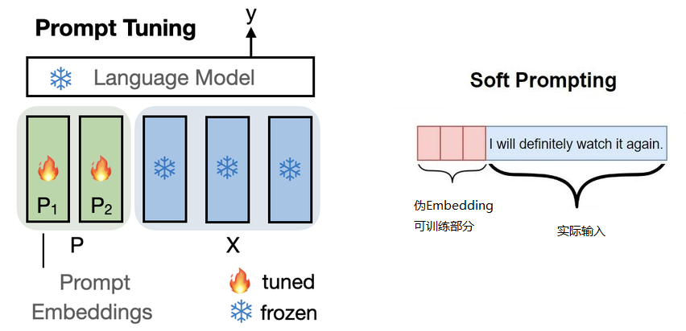
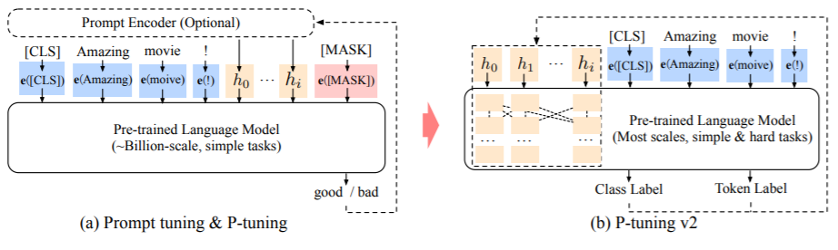
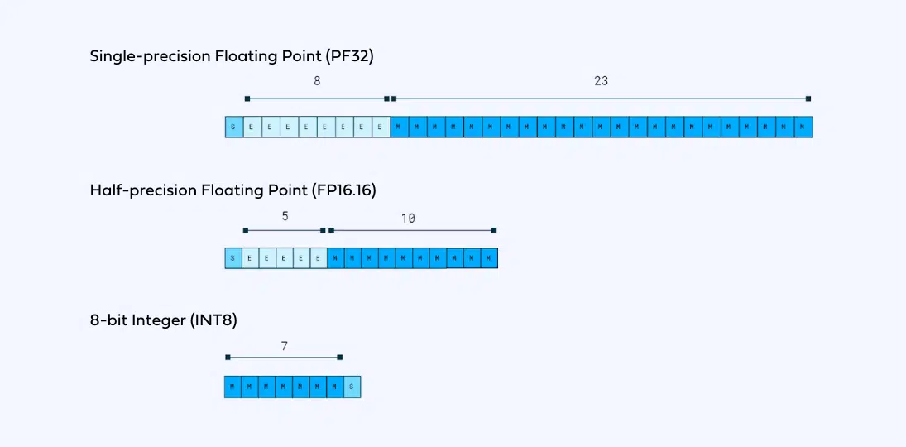

# 12模型微调下

- 模型训练（Training）
- 预训练（Pre-Training）
- 微调（Fine-Tuning）
- 轻量化微调（Parameter Efficient Fine-Tuning, PEFT）

Pretraing代码参考，以 GPT-2 模型为例
- 第一步：训练 Tokenizer，代码参考：[pretraining/train_tokenizer.py](pretraining/train_tokenizer.py) 
- 第二步：预训练模型，代码参考：[pretraining/pretrain_gpt2.py](pretraining/pretrain_gpt2.py)
- 训练条件：8 * A100(40G) GPUs，训练时间约2周

## 九、transformer结构简介

三层：
1. Embedding层：将输入的 Token IDs 转成 Embedding Vectors，再加上Positional Encoding。
2. Transformer层：多层 Transformer Block 组成，每个 Block 包含多个 Multi-Head Self-Attention 和 Feed-Forward 网络。GPT-2 中有 12 个 Block；GPT-3.5 中有 96 个 Block；GPT-3.5 中每个 Block 有 96 个 Attention Heads。
3. 输出层LM Head：将 Transformer 层的输出转成 Token IDs 的概率分布。

### Transformer内部简图

内部主要有两部分：
1. Multi-Head Self-Attention
   - 有4个参数矩阵：$W_Q、W_K、W_V、W_Output$
2. Feed-Forward全连接网络：GPT中是2层全连接网络，激活函数是GELU
   - （全连接）有2个参数矩阵：$W_1、W_2$

故里面一共有6个最主要的参数矩阵

在 Self-Attention 和全连接网络之间还有个残差和LayerNorm，图中未展示

Self-Attention的计算公式

softmax(QK^T/sqrt(d_k))得到一个方针，即以行(token)为单位归一化的向量，就是注意力的权重

再乘以V，即对每一个输入进行一个加权，得到和输入维度相同的输出

### LM Head

就是将Transformer的输入与Embedding矩阵相乘，得到一个和词表维度相同的向量，再经过softmax得到每个词的概率分布。得到的就是下一个词的概率分布

这张图展示了一个全流程

扩展阅读：
- 更详细的Transformer网络拆解（Encoder-Decoder）：https://jalammar.github.io/illustrated-transformer/
- 更详细的GPT模型拆解：https://jalammar.github.io/illustrated-gpt2/

## 十、轻量化微调

相比预训练模型，只是增加了一个参数的注入

- 定义微调数据集加载器
- 定义数据处理函数
- 加载预训练模型：AutoModel.from_pretrained(MODEL_NAME_OR_PATH)
- 在预训练模型上增加任务相关输出层 （如果需要）
- 加载预训练 Tokenizer：AutoTokenizer.from_pretrained(MODEL_NAME_OR_PATH)
- **定义注入参数的方法（见下文）**
- 定义各种超参
- 定义 Trainer
- 定义 Evaluation Metric
- 开始训练

根据注入方式的不同，产生了不同的微调方法，具体如下：

### 10.1、Prompt Tuning

- 在输入序列前（输入向量的那一层层），额外加入一组伪 Embedding 向量
- 只训练这组伪 Embedding，从而达到参数微调的效果

弊端：表示能力有限。数据量到一定程度的时候，就吃不动了，没有更好的训练效果。对于适应训练集的能力有局限性

### 10.2、P-Tuning

- 用一个生成器生成上述伪 Embedding
- 只有生成器的参数是可训练的

### 10.3、Prefix-Tuning

- 伪造前面的 Hidden States
- 只训练伪造的这个 Prefix

每一层都有一个输出，96层的话，就有96个输出。在每一层输出的前面，造n个假的隐层

### 10.4、LoRA

- 在 Transformer 的参数矩阵上加一个低秩矩阵（$A\times B$）
- 只训练 A，B
- 理论上可以把上述方法应用于 Transformer 中的任意参数矩阵，包括 Embedding 矩阵
- 通常应用于 Query, Value 两个参数矩阵

实际的LoRA训练，对于显存要求也比较大，在此基础之上，提出了QLoRA

### 10.5、QLoRA

本质上还是LoRA，只是在LoRA的基础上，进行了极端的量化

什么是模型量化

浮点数是32位，占4个字节。量化是8位，甚至4位

更多参考: https://huggingface.co/blog/hf-bitsandbytes-integration

QLoRA 引入了许多创新来在不牺牲性能的情况下节省显存：

- 4位 NormalFloat（NF4），一种对于正态分布权重而言信息理论上最优的新数据类型
- 双重量化，不止量化了精度，还量化了alpha vector：通过量化量化常数来减少平均内存占用
- 分页优化器，用于管理内存峰值

原文实现：单个48G的GPU显卡上微调65B的参数模型，保持16字节微调任务的性能

问题
1. 可能突然爆Loss
2. 数据结构是自己定义的，在推理时候不能用transformers和PyTorch来加速，所以模型推理慢很多

因此商用还不是很友好
可以在4090上实操LLaMa模型

### 10.6、AdaLoRA

- 不预先指定可训练矩阵的秩
- 根据参数矩阵的重要性得分，在参数矩阵之间自适应地分配参数预算。

## 答疑

词向量是跟着语言模型的训练一起训练出来的

如果是轻量化Fine-tune，那么词向量是冻结的。如果是全量Fine-tune，那么词向量是可以训练的

## 十一·、**实战** 

基于ChatGLM3或Llama2， 微调一个同时具有NLU和问答能力对话机器人

### 11.1、数据源

酒店预订场景
https://github.com/thu-coai/CrossWOZ

酒店数据库
https://github.com/thu-coai/CrossWOZ/blob/master/data/crosswoz/database/hotel_db.json

### 11.2、数据增强

- 从CrossWOZ数据集中抽取了只关于酒店的对话
- 利用ChatGPT进行如下修改和补充
    - 对设施的描述更口语化：“找一家有国际长途电话的酒店” -> “找一家能打国际长途的酒店”
    - 补充一定比例的多轮问答，和结束语对话（p=0.3）
    - 补充按酒店名（简称）、价格上限查询的对话（原数据中没有这类说法）
 
最终按8:1:1拆分训练集、验证集和测试集

写了很多Prompt，来将数据集构造成比较自然的对话数据集

训练出的模型，既要有function calling的能力，又要有对话的能力

### 11.3、数据的基本拼接方式

看到62min
